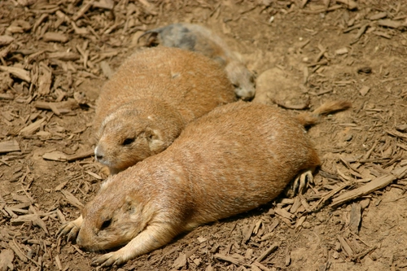
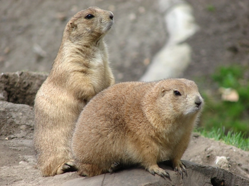
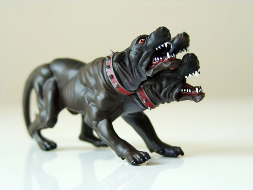
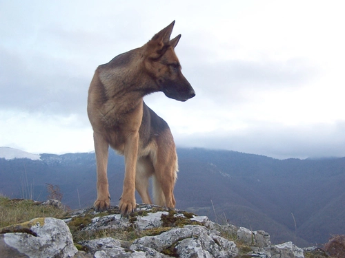
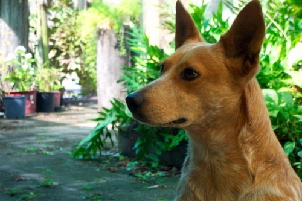
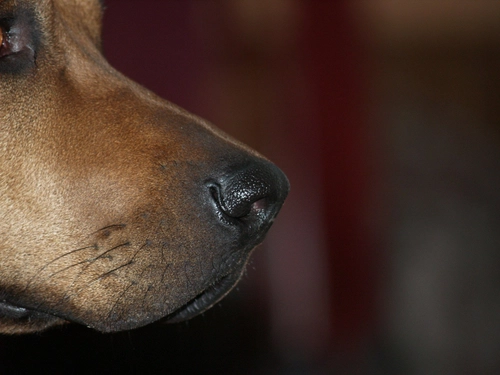
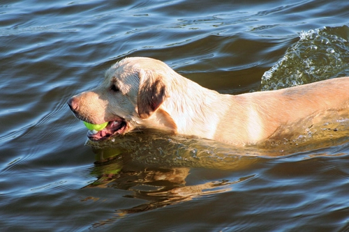
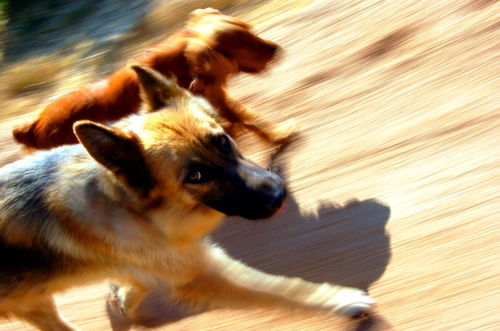
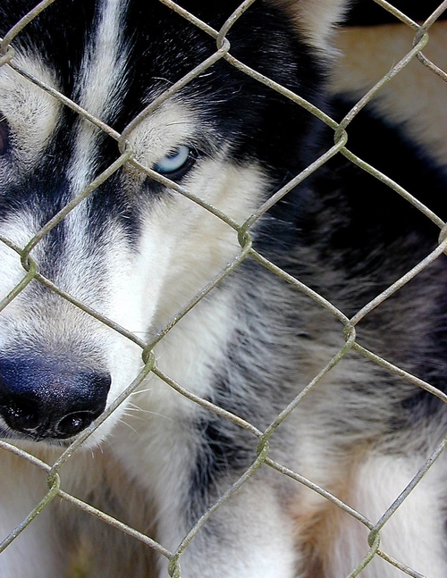

# scrapper exercises for bairesdev

> Scrappers used to capture data from www.freeimages.com as an exercise to BairesDev

### Setup

* Python Version 3.9.12
* Poetry
* Requests
* BeautifulSoap
* Selenium
* Playwright

### How to run this project

* Run ``make dependencies`` to install python dependencies
* Run ``make scrapp-all`` to execute all scrappers
* Run ``make scrapp-selenium`` to execute selenium scrappers
* Run ``make scrapp-playwright`` to execute selenium scrappers
* Run ``make scrapp-beautifulsoup`` to execute selenium scrappers
* Run ``make tests`` to execute tests

## About this Project ?

In this project I developed three different approaches to capture data from the freeimages website, by using BeautifulSoup, Selenium Webdriver and playwright.

Both approaches brings 15 pages of the website and retrieving and storing a total of ~1000 itens on a Sqlite.

You can execute any scrapper by running the ``main.py`` script passing the name of the scrapper as arguments

Example : ``python main.py --scrapper_type selenium``

#### Scrapper using Python Requests and BeautifulSoup:

In this approach, I'm making a http request in the API and parsing the html content by using BeautifulSoup library.
This is a good approach if the given API doesnt block our request by using captcha or other protection systems.
The advantages of using this approach is the high speed and simple usage.

#### Scrapper using Selenium

In this approach I'am collecting all data from the 15 pages of the site as well, but using a serial approach, one page at once.

Using selenium is a good approach when websites uses captcha protections, because it gives us the possibility to break captcha by using captcha breakers like 2captcha.

I also developed a login access demonstration to the website, putting dummy credentials and clicking in the Login Button.

### Scrapper using Playwright

Playwright gives possibilities of async scrapping. I did not used the async approach in this project but it's a very interesting tool.

#### Data Scrapped

The Sqlite database is saved in ``db`` folder. 

The scrappers are persisting the following data in the db ``img_url``, ``alt``, ``page``, ``date_happened``.

There are three tables in the db ``crawlers_request``, ``crawlers_selenium`` and ``crawlers_beautifulsoup``.

#### Unit Tests

I have developed developed unit tests using pytest and got 98% of coverage on the project.
run make test to verify unit tests

## Questions !

## How can we automate login page ?

* The login page was automated by using Selenium, navigating to the login page and putting the credentials. I used dummy creds to implement this, so the website wont really log in, so the login function is just for letting know if its possible.

## How to scale ?

#### Code Way

* I used the Threading library to make the get requests run parallellized in order to speed up the crawler.
* This is a code manner to scale up the crawler and bring more data.
* In this example, the crawler captured One thousand items in less than 10 seconds, then, based on this test, we would be able to capture 360K items from website per hour.

> 100 items/1sec * 60 secs * 60 min = 360K items per hour

* We just have to be carefull by using this approach because it can cause troubles to the crawled website, and the website owners can also block our IP.
* In order to avoid being blocked we can also use a VPN or a Proxy Server

#### Cloud Way

* We can use an AWS lambda to do the job. AWS lambdas are ephemeral and their IP changes across the time, so we can scale the scrapping avoiding the IP blocking.

# Aditional Features! Yolo Validation

I added an optional feature in the project in order to validate if all the images from website are really from dogs and not from prairie dogs, cerberus or hot dogs.

I am using ultralytics library to run YOLO to detect dogs on the scrapped images.

The model I am using is a general purpose model and needs to be trained on a dog dataset to improve it.

## Results of using yolo

The tests below were taken by crawling only the first page.

> www.freeimages.com/search/dogs/1

### Without Yolo 1 Request per image: 

Took 1 second to bring 60 images. But there are 3 images from no dogs. 2 prairie dogs and 1 cerberus.

### With Yolo, 2 Requests per image + detection: 

Took 15 seconds to crawl 47 items. With this pretrained model, 3 were positive and 6 were false positives.
It took a lot of time more to crawl items, but it is a good approach to have sure that all images are from dogs.

## Positives, No dog Images:

## False Positives, dog Images misundertood by the model ( Need further training on dog Dataset ):

detected as a horse

detected as a bear

detected as a bird

detected as a bear

detected as a horse

detected as a horse

## Command to run with Yolo

* Run ``make scrapp-beautifulsoup-yolo`` to run the beautifull soup with Yolo

## Future Improvements about Yolo :

* Find a good dog dataset to train 